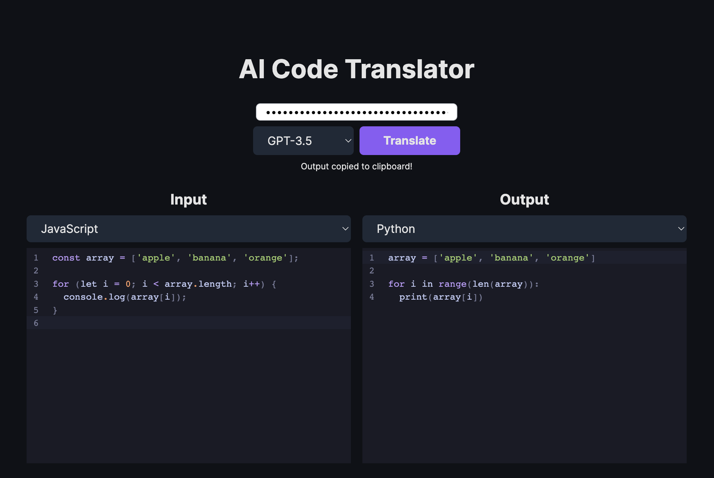

# PyDocAss - Python Documentation Assistant

This repository contains a web application that helps developers document Python code with the assistance of AI.



## Project Structure

The project has been organized into a more maintainable structure:

- `frontend/`: Contains the Next.js frontend application
- `backend/`: Contains the Python backend application
- `docker/`: Docker configuration files
- `scripts/`: Utility scripts
- `docs/`: Project documentation

For more details on the project structure, please see [docs/README.md](docs/README.md).

## Running Locally

**Prerequisites**

Before running the application, you need to set up your environment variables:

1. Copy the `.env.local.example` file to `.env`:
   ```bash
   cp .env.local.example .env
   ```
2. Open the `.env` file and fill in the required values (API keys, database connection, etc.)

**1. Frontend**

```bash
cd frontend
npm install
npm run dev
```

**2. Backend**

```bash
cd backend
pip install -r requirements.txt
python -m pydocass
```

**3. Docker**

```bash
docker-compose up -d
```

## Contributing

Contributions are welcome! Please feel free to submit a Pull Request.

# PyDocAss CLI

A command-line interface for the Python Documentation Assistant (PyDocAss), which automatically adds type annotations, docstrings, and comments to your Python code.

## Requirements

- Python 3.7+
- OpenAI API key or Nebius AI Studio API key

## Installation

Make sure you have the required packages installed:

```bash
pip install pydocass openai black
```

## Usage

```bash
./cli_document.py [options] input_file
```

Or:

```bash
python cli_document.py [options] input_file
```

### Arguments

- `input_file`: Path to the Python file to document. Use `-` to read from stdin.

### Options

- `-o, --output`: Path to write the documented code. If not provided, will print to stdout.
- `--no-modify-existing`: Don't modify existing documentation.
- `--no-arguments-annotations`: Don't write argument annotations.
- `--no-docstrings`: Don't write docstrings.
- `--no-comments`: Don't write comments.
- `--model`: Model checkpoint to use. Default: Qwen/Qwen2.5-Coder-32B-Instruct-fast
- `--api-key`: API key for Nebius AI Studio or OpenAI. Can also be set via NEBIUS_API_KEY or OPENAI_API_KEY environment variables.
- `--verbose`: Show progress updates during documentation process.

## Examples

Document a Python file and print the result to stdout:

```bash
./cli_document.py example.py
```

Document a Python file and save the result to a new file:

```bash
./cli_document.py example.py -o documented_example.py
```

Document a Python file with specific options:

```bash
./cli_document.py --no-comments --no-docstrings example.py -o annotations_only.py
```

Read from stdin and write to a file:

```bash
cat example.py | ./cli_document.py - -o documented_example.py
```

## Environment Variables

You can set your API key using environment variables:

```bash
export NEBIUS_API_KEY=your_api_key
# or
export OPENAI_API_KEY=your_api_key
```

Then run the script without specifying the API key:

```bash
./cli_document.py example.py
```
